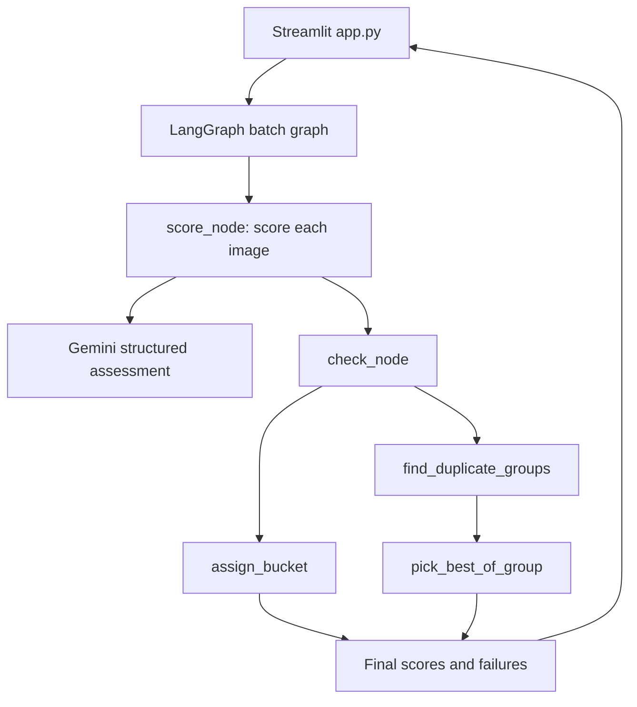

# Cully: The Photo Culling Agent

Cully helps photographers review a shoot in batches. Gemini assesses each
image for sharpness, framing, expression, and fit with the photographer's
preferences. A LangGraph workflow then applies deterministic bucket rules and
detects near-duplicates. Review the results in Streamlit, move photos between
buckets, and download the original keepers.

## What It Does

- Accepts JPG, JPEG, and PNG uploads and groups them into named batches.
- Scores images against the batch's creative preferences.
- Sorts results into **Keepers**, **Review**, and **Rejects**.
- Detects near-duplicate groups using perceptual hashes and keeps the
   highest-scoring image in each group; weaker group members are rejected.
- Provides paginated galleries, individual and bulk bucket actions, previews,
   retries for failed scores, and a ZIP download of original keepers.
- Prepares resized, EXIF-corrected JPEGs for Gemini while preserving the
   uploaded originals for previews and export.

## Architecture



- `app.py` owns the Streamlit interface, batch/session state, upload handling,
   progress, galleries, manual actions, and keeper export.
- `agent/graph.py` builds the LangGraph workflow. `score_node` calls Gemini
   for every image and records per-image failures; `check_node` applies the
   deterministic tools to successful assessments.
- `agent/scoring.py` is the only module that calls Gemini. Gemini returns an
   assessment, not a bucket decision.
- `agent/tools.py` contains plain Python decisions: bucket assignment,
   perceptual-hash duplicate grouping, and best-image selection.
- `agent/tracing.py` configures OpenTelemetry/OpenInference instrumentation
   for Gemini and LangGraph, exporting traces to Arize AX when configured.

### Bucket Rules

- **Reject:** any of sharpness, framing, or expression is 3 or lower.
- **Keep:** all three scores are 7 or higher and the image matches the stated
   preferences.
- **Review:** all other assessments.

For each near-duplicate group, Cully maximizes `2 × sharpness + framing +
expression`, breaking ties with sharpness. Other images in that group are
marked Reject.

## Run Locally

Create a virtual environment in the project folder, install dependencies, and
start Streamlit:

```powershell
python -m venv .venv
.\.venv\Scripts\Activate.ps1
python -m pip install -r requirements.txt
Copy-Item .env.example .env
streamlit run app.py
```

On macOS/Linux, activate the environment with `source .venv/bin/activate` and
copy the example with `cp .env.example .env`.

Set `GOOGLE_API_KEY` in `.env` before scoring. Keep `.env` private and never
commit API keys. Recreate the virtual environment if the project is moved to a
different folder; virtual environments contain path-specific launchers.

## Configuration

| Variable | Purpose | Default |
| --- | --- | --- |
| `GOOGLE_API_KEY` | Gemini API key; required to score images. | None |
| `GEMINI_MODEL` | Gemini model name. | `gemini-3.1-flash-lite` |
| `GEMINI_MIN_INTERVAL` | Minimum delay between Gemini calls, in seconds. | `0` |
| `GEMINI_MAX_IMAGE_EDGE` | Maximum prepared-image edge, in pixels. | `2000` |
| `GEMINI_JPEG_QUALITY` | JPEG quality for prepared images. | `85` |
| `GEMINI_MAX_ATTEMPTS` | Maximum attempts for retryable Gemini errors. | `4` |
| `GEMINI_THINKING_LEVEL` | Gemini thinking level. | `MINIMAL` |
| `ARIZE_SPACE_ID` | Arize AX space ID; enables tracing with the API key. | Unset |
| `ARIZE_API_KEY` | Arize AX API key. | Unset |

The Gemini tuning values can be placed in `.env` when defaults are not
appropriate. Arize tracing is optional; without both Arize values, the app
runs without exporting traces.

## Data and Persistence

Uploaded originals are written to `uploaded_photos/`. Batch metadata and
gallery decisions live in Streamlit session state, so they are not durable
across a server restart. The original files remain on disk until removed
separately.
